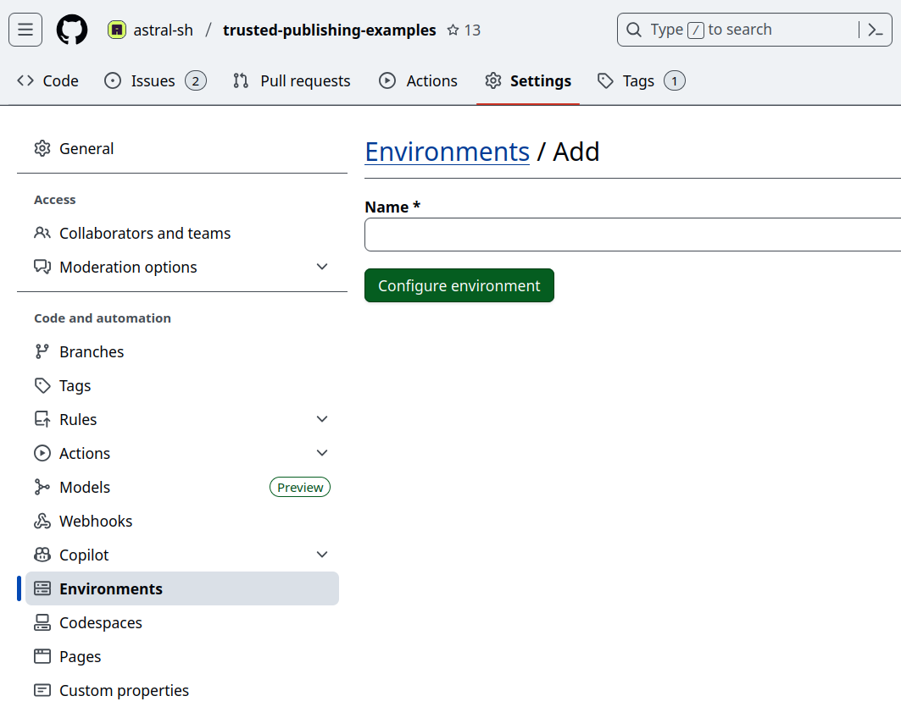
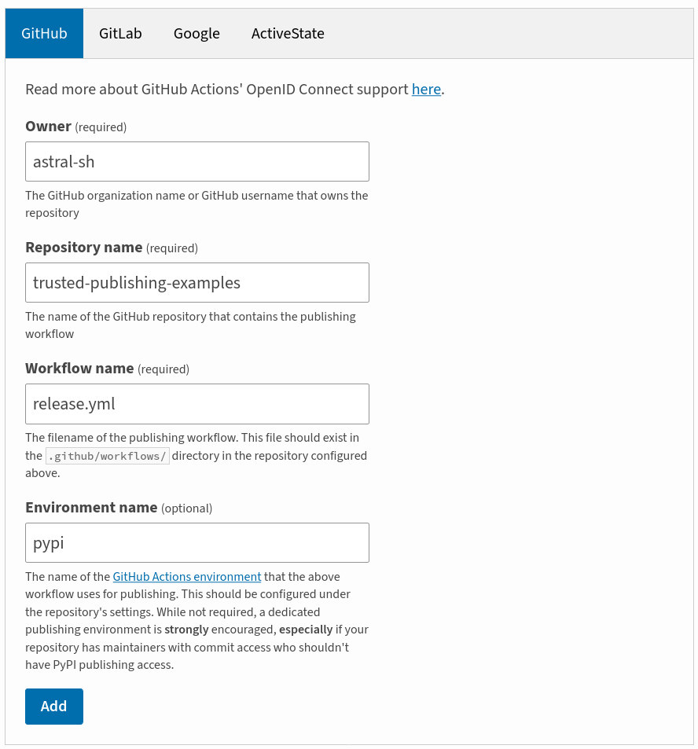
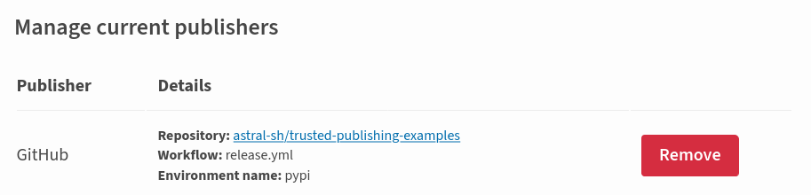

# 在 GitHub Actions 中使用 uv

## 安装

在 GitHub Actions 中使用 uv 时，我们推荐使用官方的 [`astral-sh/setup-uv`](https://github.com/astral-sh/setup-uv) action，它可以安装 uv、将其添加到 PATH、（可选）持久化缓存等，并支持所有 uv 兼容的平台。

安装最新版本的 uv：

```yaml title="example.yml" hl_lines="11 12"
name: Example

jobs:
  uv-example:
    name: python
    runs-on: ubuntu-latest

    steps:
      - uses: actions/checkout@v6

      - name: Install uv
        uses: astral-sh/setup-uv@08807647e7069bb48b6ef5acd8ec9567f424441b # v8.1.0
```

建议锁定到特定的 uv 版本，这是一种最佳实践，例如：

```yaml title="example.yml" hl_lines="14 15"
name: Example

jobs:
  uv-example:
    name: python
    runs-on: ubuntu-latest

    steps:
      - uses: actions/checkout@v6

      - name: Install uv
        uses: astral-sh/setup-uv@08807647e7069bb48b6ef5acd8ec9567f424441b # v8.1.0
        with:
          # Install a specific version of uv.
          version: "0.11.23"
```

## 设置 Python

可以使用 `python install` 命令安装 Python：

```yaml title="example.yml" hl_lines="14 15"
name: Example

jobs:
  uv-example:
    name: python
    runs-on: ubuntu-latest

    steps:
      - uses: actions/checkout@v6

      - name: Install uv
        uses: astral-sh/setup-uv@08807647e7069bb48b6ef5acd8ec9567f424441b # v8.1.0

      - name: Set up Python
        run: uv python install
```

这将遵循项目中锁定的 Python 版本。

或者，也可以使用 GitHub 官方的 `setup-python` action。这可能会更快，因为 GitHub 会将 Python 版本与 runner 一起缓存。

设置 [`python-version-file`](https://github.com/actions/setup-python/blob/main/docs/advanced-usage.md#using-the-python-version-file-input) 选项以使用项目锁定的版本：

```yaml title="example.yml" hl_lines="14"
name: Example

jobs:
  uv-example:
    name: python
    runs-on: ubuntu-latest

    steps:
      - uses: actions/checkout@v6

      - name: "Set up Python"
        uses: actions/setup-python@v6
        with:
          python-version-file: ".python-version"

      - name: Install uv
        uses: astral-sh/setup-uv@08807647e7069bb48b6ef5acd8ec9567f424441b # v8.1.0
```

或者，指定 `pyproject.toml` 文件以忽略锁定版本，使用与项目 `requires-python` 约束兼容的最新版本：

```yaml title="example.yml" hl_lines="14"
name: Example

jobs:
  uv-example:
    name: python
    runs-on: ubuntu-latest

    steps:
      - uses: actions/checkout@v6

      - name: "Set up Python"
        uses: actions/setup-python@v6
        with:
          python-version-file: "pyproject.toml"

      - name: Install uv
        uses: astral-sh/setup-uv@08807647e7069bb48b6ef5acd8ec9567f424441b # v8.1.0
```

## 多个 Python 版本

当使用矩阵（matrix）策略测试多个 Python 版本时，可以通过 `astral-sh/setup-uv` 设置 Python 版本，这将覆盖 `pyproject.toml` 或 `.python-version` 文件中的 Python 版本配置：

```yaml title="example.yml" hl_lines="17 18"
jobs:
  build:
    name: continuous-integration
    runs-on: ubuntu-latest
    strategy:
      matrix:
        python-version:
          - "3.10"
          - "3.11"
          - "3.12"

    steps:
      - uses: actions/checkout@v6

      - name: Install uv and set the Python version
        uses: astral-sh/setup-uv@08807647e7069bb48b6ef5acd8ec9567f424441b # v8.1.0
        with:
          python-version: ${{ matrix.python-version }}
```

如果不使用 `setup-uv` action，你可以设置 `UV_PYTHON` 环境变量：

```yaml title="example.yml" hl_lines="12"
jobs:
  build:
    name: continuous-integration
    runs-on: ubuntu-latest
    strategy:
      matrix:
        python-version:
          - "3.10"
          - "3.11"
          - "3.12"
    env:
      UV_PYTHON: ${{ matrix.python-version }}
    steps:
      - uses: actions/checkout@v6
```

## 同步与运行

安装 uv 和 Python 之后，可以使用 `uv sync` 安装项目，并使用 `uv run` 在环境中运行命令：

```yaml title="example.yml" hl_lines="15 17-22"
name: Example

jobs:
  uv-example:
    name: python
    runs-on: ubuntu-latest

    steps:
      - uses: actions/checkout@v6

      - name: Install uv
        uses: astral-sh/setup-uv@08807647e7069bb48b6ef5acd8ec9567f424441b # v8.1.0

      - name: Install the project
        run: uv sync --locked --all-extras --dev

      - name: Run tests
        # For example, using `pytest`
        run: uv run pytest tests
```

!!! tip

    [`UV_PROJECT_ENVIRONMENT` 设置](../../concepts/projects/config.md#project-environment-path)可用于将依赖安装到系统 Python 环境中，而不是创建虚拟环境。

## 缓存

在多次工作流运行之间存储 uv 的缓存可以缩短 CI 耗时。

[`astral-sh/setup-uv`](https://github.com/astral-sh/setup-uv) 内置了缓存持久化支持：

```yaml title="example.yml"
- name: Enable caching
  uses: astral-sh/setup-uv@08807647e7069bb48b6ef5acd8ec9567f424441b # v8.1.0
  with:
    enable-cache: true
```

或者，你也可以使用 `actions/cache` action 手动管理缓存：

```yaml title="example.yml"
jobs:
  install_job:
    env:
      # Configure a constant location for the uv cache
      UV_CACHE_DIR: /tmp/.uv-cache

    steps:
      # ... setup up Python and uv ...

      - name: Restore uv cache
        uses: actions/cache@v5
        with:
          path: /tmp/.uv-cache
          key: uv-${{ runner.os }}-${{ hashFiles('uv.lock') }}
          restore-keys: |
            uv-${{ runner.os }}-${{ hashFiles('uv.lock') }}
            uv-${{ runner.os }}

      # ... install packages, run tests, etc ...

      - name: Minimize uv cache
        run: uv cache prune --ci
```

`uv cache prune --ci` 命令用于减少缓存大小，并针对 CI 进行了优化。其对性能的影响取决于所安装的包。

!!! tip

    如果使用 `uv pip`，请在缓存键中使用 `requirements.txt` 而不是 `uv.lock`。

!!! note

    [post-job-hook]: https://docs.github.com/en/actions/hosting-your-own-runners/managing-self-hosted-runners/running-scripts-before-or-after-a-job

    当使用非临时的自托管 runner 时，默认缓存目录可能会无限增长。在这种情况下，在作业之间共享缓存可能不是最优选择。建议将缓存移到 GitHub Workspace 内部，并在作业完成后使用 [Post Job Hook][post-job-hook] 将其删除。

    ```yaml
    install_job:
      env:
        # Configure a relative location for the uv cache
        UV_CACHE_DIR: ${{ github.workspace }}/.cache/uv
    ```

    使用 post job hook 需要在自托管 runner 上将 `ACTIONS_RUNNER_HOOK_JOB_STARTED` 环境变量设置为清理脚本的路径，如下所示。

    ```sh title="clean-uv-cache.sh"
    #!/usr/bin/env sh
    uv cache clean
    ```

## 使用 `uv pip`

如果使用 `uv pip` 接口而非 uv 项目接口，uv 默认需要虚拟环境。要允许将包安装到系统环境中，可以在所有 `uv` 调用中使用 `--system` 标志，或设置 `UV_SYSTEM_PYTHON` 变量。

`UV_SYSTEM_PYTHON` 变量可以在不同作用域中定义。

在顶层定义以对整个工作流启用：

```yaml title="example.yml"
env:
  UV_SYSTEM_PYTHON: 1

jobs: ...
```

或者，对工作流中的特定作业启用：

```yaml title="example.yml"
jobs:
  install_job:
    env:
      UV_SYSTEM_PYTHON: 1
    ...
```

或者，对作业中的特定步骤启用：

```yaml title="example.yml"
steps:
  - name: Install requirements
    run: uv pip install -r requirements.txt
    env:
      UV_SYSTEM_PYTHON: 1
```

要再次退出系统模式，可以在任何 uv 调用中使用 `--no-system` 标志。

## 私有仓库

如果你的项目依赖私有 GitHub 仓库（[dependencies](../../concepts/projects/dependencies.md#git)），你需要配置[个人访问令牌 (personal access token, PAT)][PAT] 以允许 uv 获取它们。

创建具有私有仓库读取权限的 PAT 后，将其添加为[仓库密钥 (repository secret)]。

然后，你可以使用 [`gh`](https://cli.github.com/) CLI（默认安装在 GitHub Actions runner 中）配置 [Git 凭据辅助程序](../../concepts/authentication/git.md#git-credential-helpers)，以便在查询 `github.com` 托管的仓库时使用 PAT。

例如，如果你将仓库密钥命名为 `MY_PAT`：

```yaml title="example.yml"
steps:
  - name: Register the personal access token
    run: echo "${{ secrets.MY_PAT }}" | gh auth login --with-token
  - name: Configure the Git credential helper
    run: gh auth setup-git
```

[PAT]:
  https://docs.github.com/en/authentication/keeping-your-account-and-data-secure/managing-your-personal-access-tokens
[repository secret]:
  https://docs.github.com/en/actions/security-for-github-actions/security-guides/using-secrets-in-github-actions#creating-secrets-for-a-repository

## 发布到 PyPI

可以使用 uv 在 GitHub Actions 中构建包并将其发布到 PyPI。我们在本指南之外还提供了一个独立示例，位于 [astral-sh/trusted-publishing-examples](https://github.com/astral-sh/trusted-publishing-examples)。该工作流使用[可信发布 (trusted publishing)](https://docs.pypi.org/trusted-publishers/)，因此无需配置凭据。

在示例工作流中，我们使用一个脚本来测试源码分发包（source distribution）和 wheel 是否都能正常工作，并且没有遗漏任何文件。此步骤是推荐但可选的。

首先，向你的项目添加一个发布工作流：

```yaml title=".github/workflows/release.yml"
name: "Publish release to PyPI"

on:
  push:
    tags:
      # Publish on any tag starting with a `v`, e.g., v0.1.0
      - v*

jobs:
  run:
    runs-on: ubuntu-latest
    environment:
      name: pypi
    permissions:
      id-token: write
      contents: read
    steps:
      - name: Checkout
        uses: actions/checkout@v6
      - name: Install uv
        uses: astral-sh/setup-uv@08807647e7069bb48b6ef5acd8ec9567f424441b # v8.1.0
      - name: Install Python 3.13
        run: uv python install 3.13
      - name: Build
        run: uv build
      # Check that basic features work and we didn't miss to include crucial files
      - name: Smoke test (wheel)
        run: uv run --isolated --no-project --with dist/*.whl tests/smoke_test.py
      - name: Smoke test (source distribution)
        run: uv run --isolated --no-project --with dist/*.tar.gz tests/smoke_test.py
      - name: Publish
        run: uv publish
```

然后，在 GitHub 仓库的 "Settings" -> "Environments" 下创建工作流中定义的环境。



在 PyPI 项目的 "Publishing" 设置中添加一个[可信发布者 (trusted publisher)](https://docs.pypi.org/trusted-publishers/adding-a-publisher/)。确保所有字段与你的 GitHub 配置匹配。



保存后：



最后，为发布打标签并推送。确保标签以 `v` 开头以匹配工作流中的模式。

```console
$ git tag -a v0.1.0 -m v0.1.0
$ git push --tags
```
