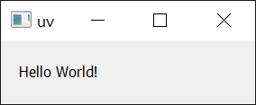

# 运行脚本

Python 脚本是旨在独立执行的文件，例如，通过 `python <script>.py`。使用 uv 执行脚本可确保脚本依赖项得到管理，而无需手动管理环境。

!!! note

    如果您不熟悉 Python 环境：每个 Python 安装都有一个可以安装包的环境。通常，建议创建[_虚拟_ 环境](https://docs.python.org/3/library/venv.html)来隔离每个脚本所需的包。uv 会自动为您管理虚拟环境，并倾向于使用[声明式](#_2)方法来处理依赖项。

## 运行无依赖的脚本

如果您的脚本没有依赖项，您可以使用 `uv run` 来执行它：

```python title="example.py"
print("Hello world")
```

```console
$ uv run example.py
Hello world
```

<!-- TODO(zanieb): 一旦我们有了 `python` shim，请在此处注意您可以使用 `python` 执行它 -->

同样，如果您的脚本依赖于标准库中的模块，则无需执行任何其他操作：

```python title="example.py"
import os

print(os.path.expanduser("~"))
```

```console
$ uv run example.py
/Users/astral
```

可以向脚本提供参数：

```python title="example.py"
import sys

print(" ".join(sys.argv[1:]))
```

```console
$ uv run example.py test
test

$ uv run example.py hello world!
hello world!
```

此外，您的脚本可以直接从 stdin 读取：

```console
$ echo 'print("hello world!")' | uv run -
```

或者，如果您的 shell 支持 [here-documents](https://en.wikipedia.org/wiki/Here_document)：

```bash
uv run - <<EOF
print("hello world!")
EOF
```

请注意，如果您在_项目_（即包含 `pyproject.toml` 的目录）中使用 `uv run`，它将在运行脚本之前安装当前项目。如果您的脚本不依赖于项目，请使用 `--no-project` 标志跳过此操作：

```console
$ # Note: the `--no-project` flag must be provided _before_ the script name.
$ uv run --no-project example.py
```

有关在项目中工作的更多详细信息，请参阅[项目指南](./projects.md)。

## 运行带依赖的脚本

当您的脚本需要其他包时，必须将它们安装到脚本运行的环境中。uv 倾向于按需创建这些环境，而不是使用手动管理依赖项的长期虚拟环境。这需要显式声明脚本所需的依赖项。通常，建议使用[项目](./projects.md)或[内联元数据](#_2)来声明依赖项，但 uv 也支持按次调用请求依赖项。

例如，以下脚本需要 `rich`。

```python title="example.py"
import time
from rich.progress import track

for i in track(range(20), description="For example:"):
    time.sleep(0.05)
```

如果在未指定依赖项的情况下执行，此脚本将失败：

```console
$ uv run --no-project example.py
Traceback (most recent call last):
  File "/Users/astral/example.py", line 2, in <module>
    from rich.progress import track
ModuleNotFoundError: No module named 'rich'
```

使用 `--with` 选项请求依赖项：

```console
$ uv run --with rich example.py
For example: ━━━━━━━━━━━━━━━━━━━━━━━━━━━━━━━━━━━━━━━━ 100% 0:00:01
```

如果需要特定版本，可以向请求的依赖项添加约束：

```console
$ uv run --with 'rich>12,<13' example.py
```

可以通过重复使用 `--with` 选项来请求多个依赖项。

请注意，如果在_项目_中使用 `uv run`，这些依赖项将 _另外_ 包含在项目的依赖项中。要选择退出此行为，请使用 `--no-project` 标志。

## 创建 Python 脚本

Python 最近添加了一种用于[内联脚本元数据](https://packaging.python.org/en/latest/specifications/inline-script-metadata/#inline-script-metadata)的标准格式。它允许选择 Python 版本和定义依赖项。使用 `uv init --script` 来使用内联元数据初始化脚本：

```console
$ uv init --script example.py --python 3.12
```

## 声明脚本依赖项

内联元数据格式允许在脚本本身中声明脚本的依赖项。

uv 支持为您添加和更新内联脚本元数据。使用 `uv add --script` 来声明脚本的依赖项：

```console
$ uv add --script example.py 'requests<3' 'rich'
```

这将在脚本顶部添加一个 `script` 部分，使用 TOML 声明依赖项：

```python title="example.py"
# /// script
# dependencies = [
#   "requests<3",
#   "rich",
# ]
# ///

import requests
from rich.pretty import pprint

resp = requests.get("https://peps.python.org/api/peps.json")
data = resp.json()
pprint([(k, v["title"]) for k, v in data.items()][:10])
```

uv 将自动创建一个包含运行脚本所需依赖项的环境，例如：

```console
$ uv run example.py
[
│   ('1', 'PEP Purpose and Guidelines'),
│   ('2', 'Procedure for Adding New Modules'),
│   ('3', 'Guidelines for Handling Bug Reports'),
│   ('4', 'Deprecation of Standard Modules'),
│   ('5', 'Guidelines for Language Evolution'),
│   ('6', 'Bug Fix Releases'),
│   ('7', 'Style Guide for C Code'),
│   ('8', 'Style Guide for Python Code'),
│   ('9', 'Sample Plaintext PEP Template'),
│   ('10', 'Voting Guidelines')
]
```

!!! important

    使用内联脚本元数据时，即使在_项目_中[使用 `uv run`](../concepts/projects/run.md)，项目的依赖项也将被忽略。不需要 `--no-project` 标志。

uv 还尊重 Python 版本要求：

```python title="example.py"
# /// script
# requires-python = ">=3.12"
# dependencies = []
# ///

# 使用 Python 3.12 中添加的一些语法
type Point = tuple[float, float]
print(Point)
```

!!! note

    即使为空，也必须提供 `dependencies` 字段。

`uv run` 将搜索并使用所需的 Python 版本。如果未安装，将下载 Python 版本 — 有关更多详细信息，请参阅有关 [Python 版本](../concepts/python-versions.md)的文档。

## 使用 shebang 创建可执行文件

可以添加 shebang 使脚本无需使用 `uv run` 即可执行 — 这使得运行位于 `PATH` 或当前文件夹中的脚本变得容易。

例如，创建一个名为 `greet` 的文件，其内容如下

```python title="greet"
#!/usr/bin/env -S uv run --script

print("Hello, world!")
```

确保您的脚本是可执行的，例如，使用 `chmod +x greet`，然后运行脚本：

```console
$ ./greet
Hello, world!
```

在此上下文中也支持声明依赖项，例如：

```python title="example"
#!/usr/bin/env -S uv run --script
#
# /// script
# requires-python = ">=3.12"
# dependencies = ["httpx"]
# ///

import httpx

print(httpx.get("https://example.com"))
```

## 使用备用包索引

如果您希望使用备用[包索引](../concepts/indexes.md)来解析依赖项，您可以使用 `--index` 选项提供索引：

```console
$ uv add --index "https://example.com/simple" --script example.py 'requests<3' 'rich'
```

这会将包数据包含在内联元数据中：

```python
# [[tool.uv.index]]
# url = "https://example.com/simple"
```

如果您需要身份验证才能访问包索引，请参阅[包索引](../concepts/indexes.md)文档。

## 锁定依赖项

uv 支持使用 `uv.lock` 文件格式为 PEP 723 脚本锁定依赖项。与项目不同，脚本必须使用 `uv lock` 显式锁定：

```console
$ uv lock --script example.py
```

运行 `uv lock --script` 将在脚本旁边创建一个 `.lock` 文件（例如，`example.py.lock`）。

一旦锁定，后续操作（如 `uv run --script`、`uv add --script`、`uv export --script` 和 `uv tree --script`）将重用锁定的依赖项，并在必要时更新锁文件。

如果不存在此类锁文件，`uv export --script` 等命令仍将按预期运行，但不会创建锁文件。

## 提高可复现性

除了锁定依赖项外，uv 还支持内联脚本元数据的 `tool.uv` 部分中的 `exclude-newer` 字段，以限制 uv 仅考虑在特定日期之前发布的发行版。这对于在稍后的时间点运行时提高脚本的可复现性很有用。

日期必须指定为 [RFC 3339](https://www.rfc-editor.org/rfc/rfc3339.html) 时间戳
（例如，`2006-12-02T02:07:43Z`）。

```python title="example.py"
# /// script
# dependencies = [
#   "requests",
# ]
# [tool.uv]
# exclude-newer = "2023-10-16T00:00:00Z"
# ///

import requests

print(requests.__version__)
```

## 使用不同的 Python 版本

uv 允许在每次脚本调用时请求任意 Python 版本，例如：

```python title="example.py"
import sys

print(".".join(map(str, sys.version_info[:3])))
```

```console
$ # 使用默认 Python 版本，在您的机器上可能有所不同
$ uv run example.py
3.12.6
```

```console
$ # 使用特定的 Python 版本
$ uv run --python 3.10 example.py
3.10.15
```

有关请求 Python 版本的更多详细信息，请参阅 [Python 版本请求](../concepts/python-versions.md#_1)文档。

## 使用 GUI 脚本

在 Windows 上，`uv` 将使用 `pythonw` 运行以 `.pyw` 扩展名结尾的脚本：

```python title="example.pyw"
from tkinter import Tk, ttk

root = Tk()
root.title("uv")
frm = ttk.Frame(root, padding=10)
frm.grid()
ttk.Label(frm, text="Hello World").grid(column=0, row=0)
root.mainloop()
```

```console
PS> uv run example.pyw
```

{: style="height:50px;width:150px"}

同样，它也适用于依赖项：

```python title="example_pyqt.pyw"
import sys
from PyQt5.QtWidgets import QApplication, QWidget, QLabel, QGridLayout

app = QApplication(sys.argv)
widget = QWidget()
grid = QGridLayout()

text_label = QLabel()
text_label.setText("Hello World!")
grid.addWidget(text_label)

widget.setLayout(grid)
widget.setGeometry(100, 100, 200, 50)
widget.setWindowTitle("uv")
widget.show()
sys.exit(app.exec_())
```

```console
PS> uv run --with PyQt5 example_pyqt.pyw
```

{: style="height:50px;width:150px"}

## 后续步骤

要了解有关 `uv run` 的更多信息，请参阅[命令参考](../reference/cli/index.md)。

或者，继续阅读以了解如何使用 uv [运行和安装工具](./tools.md)。
