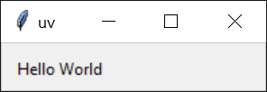
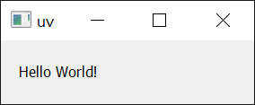

# 运行脚本 {#running-scripts}

Python 脚本（script）是一个用于独立执行的文件，例如通过 `python <script>.py` 来运行。使用 uv 执行脚本可以确保脚本依赖得到管理，而无需手动管理环境。

!!! note

    如果你不熟悉 Python 环境（environment）：每个 Python 安装都有一个可供安装包的环境。通常，建议创建[_虚拟_环境](https://docs.python.org/3/library/venv.html)（virtual environment）来隔离每个脚本所需的包。uv 会自动为你管理虚拟环境，并倾向于采用[声明式](#declaring-script-dependencies)的方式来处理依赖。

## 运行无依赖的脚本 {#running-a-script-without-dependencies}

如果你的脚本没有依赖，可以直接使用 `uv run` 执行：

```python title="example.py"
print("Hello world")
```

```console
$ uv run example.py
Hello world
```

<!-- TODO(zanieb): Once we have a `python` shim, note you can execute it with `python` here -->

同样地，如果你的脚本只依赖标准库中的模块，也无需额外操作：

```python title="example.py"
import os

print(os.path.expanduser("~"))
```

```console
$ uv run example.py
/Users/astral
```

可以向脚本传递参数：

```python title="example.py"
import sys

print(" ".join(sys.argv[1:]))
```

```console
$ uv run example.py test
test

$ uv run example.py hello world!
hello world!
```

此外，你的脚本可以直接从标准输入（stdin）读取：

```console
$ echo 'print("hello world!")' | uv run -
```

或者，如果你的 shell 支持 [here-documents](https://en.wikipedia.org/wiki/Here_document)：

```bash
uv run - <<EOF
print("hello world!")
EOF
```

请注意，如果你在_项目_（project）中使用 `uv run`，即在一个包含 `pyproject.toml` 的目录中，uv 会在运行脚本之前先安装当前项目。如果你的脚本不依赖于该项目，请使用 `--no-project` 标志跳过此步骤：

```console
$ # 注意：`--no-project` 标志必须在脚本名称_之前_提供。
$ uv run --no-project example.py
```

有关在项目中工作的更多详细信息，请参阅[项目指南](./projects.md)。

## 运行有依赖的脚本 {#running-a-script-with-dependencies}

当你的脚本需要其他包时，这些包必须安装到脚本运行的环境中。uv 倾向于按需创建这些环境，而不是使用一个长期存在的、手动管理依赖的虚拟环境。这要求显式声明脚本所需的依赖。通常，建议使用[项目](./projects.md)或[内联元数据](#declaring-script-dependencies)来声明依赖，但 uv 也支持在每次调用时指定依赖。

例如，以下脚本需要 `rich`。

```python title="example.py"
import time
from rich.progress import track

for i in track(range(20), description="For example:"):
    time.sleep(0.05)
```

如果不指定依赖就执行，此脚本将会失败：

```console
$ uv run --no-project example.py
Traceback (most recent call last):
  File "/Users/astral/example.py", line 2, in <module>
    from rich.progress import track
ModuleNotFoundError: No module named 'rich'
```

使用 `--with` 选项来指定依赖：

```console
$ uv run --with rich example.py
For example: ━━━━━━━━━━━━━━━━━━━━━━━━━━━━━━━━━━━━━━━━ 100% 0:00:01
```

如果需要特定版本，可以对指定的依赖添加约束条件：

```console
$ uv run --with 'rich>12,<13' example.py
```

可以通过重复使用 `--with` 选项来指定多个依赖。

请注意，如果在_项目_中使用 `uv run`，这些依赖将_附加_到项目的依赖之上。如需排除此行为，请使用 `--no-project` 标志。

## 创建 Python 脚本 {#creating-a-python-script}

Python 最近新增了一种标准格式用于[内联脚本元数据](https://packaging.python.org/en/latest/specifications/inline-script-metadata/#inline-script-metadata)（inline script metadata）。它允许选择 Python 版本和定义依赖。使用 `uv init --script` 来初始化带有内联元数据的脚本：

```console
$ uv init --script example.py --python 3.12
```

## 声明脚本依赖 {#declaring-script-dependencies}

内联元数据格式允许在脚本本身中声明脚本的依赖。

uv 支持为你添加和更新内联脚本元数据。使用 `uv add --script` 来声明脚本的依赖：

```console
$ uv add --script example.py 'requests<3' 'rich'
```

这将在脚本顶部添加一个 `script` 部分，使用 TOML 格式声明依赖：

```python title="example.py"
# /// script
# dependencies = [
#   "requests<3",
#   "rich",
# ]
# ///

import requests
from rich.pretty import pprint

resp = requests.get("https://peps.python.org/api/peps.json")
data = resp.json()
pprint([(k, v["title"]) for k, v in data.items()][:10])
```

uv 将自动创建一个包含运行脚本所需依赖的环境，例如：

```console
$ uv run example.py
[
│   ('1', 'PEP Purpose and Guidelines'),
│   ('2', 'Procedure for Adding New Modules'),
│   ('3', 'Guidelines for Handling Bug Reports'),
│   ('4', 'Deprecation of Standard Modules'),
│   ('5', 'Guidelines for Language Evolution'),
│   ('6', 'Bug Fix Releases'),
│   ('7', 'Style Guide for C Code'),
│   ('8', 'Style Guide for Python Code'),
│   ('9', 'Sample Plaintext PEP Template'),
│   ('10', 'Voting Guidelines')
]
```

!!! important

    使用内联脚本元数据时，即使 `uv run` [在_项目_中使用](../concepts/projects/run.md)，项目的依赖也会被忽略。无需使用 `--no-project` 标志。

uv 也会遵循 Python 版本要求：

```python title="example.py"
# /// script
# requires-python = ">=3.12"
# dependencies = []
# ///

# 使用 Python 3.12 中新增的一些语法
type Point = tuple[float, float]
print(Point)
```

!!! note

    即使为空，也必须提供 `dependencies` 字段。

`uv run` 将搜索并使用所需的 Python 版本。如果 Python 版本未安装，将会自动下载——更多详细信息请参阅 [Python 版本](../concepts/python-versions.md)文档。

## 使用 shebang 创建可执行文件 {#using-a-shebang-to-create-an-executable-file}

可以添加 shebang 来使脚本无需使用 `uv run` 即可执行——这样可以方便地运行位于 `PATH` 或当前文件夹中的脚本。

例如，创建一个名为 `greet` 的文件，内容如下：

```python title="greet"
#!/usr/bin/env -S uv run --script

print("Hello, world!")
```

确保你的脚本具有可执行权限，例如使用 `chmod +x greet`，然后运行脚本：

```console
$ ./greet
Hello, world!
```

在此上下文中也支持声明依赖，例如：

```python title="example"
#!/usr/bin/env -S uv run --script
#
# /// script
# requires-python = ">=3.12"
# dependencies = ["httpx"]
# ///

import httpx

print(httpx.get("https://example.com"))
```

## 使用替代包索引 {#using-alternative-package-indexes}

如果你希望使用替代的[包索引](../concepts/indexes.md)（package index）来解析依赖，可以通过 `--index` 选项提供索引：

```console
$ uv add --index "https://example.com/simple" --script example.py 'requests<3' 'rich'
```

这将在内联元数据中包含包数据：

```python
# [[tool.uv.index]]
# url = "https://example.com/simple"
```

如果你需要身份验证才能访问包索引，请参阅[包索引](../concepts/indexes.md)文档。

## 锁定依赖 {#locking-dependencies}

uv 支持使用 `uv.lock` 文件格式为 PEP 723 脚本锁定依赖。与项目不同，脚本必须使用 `uv lock` 显式锁定：

```console
$ uv lock --script example.py
```

运行 `uv lock --script` 将在脚本旁边创建一个 `.lock` 文件（例如 `example.py.lock`）。

一旦锁定，后续操作如 `uv run --script`、`uv add --script`、`uv export --script` 和 `uv tree --script` 将复用已锁定的依赖，并在必要时更新锁文件。

如果不存在此类锁文件，像 `uv export --script` 这样的命令仍会按预期工作，但不会创建锁文件。

## 提高可复现性 {#improving-reproducibility}

除了锁定依赖之外，uv 在内联脚本元数据的 `tool.uv` 部分中还支持 `exclude-newer` 字段，用于限制 uv 仅考虑在特定日期之前发布的分发包（distribution）。这对于提高脚本在后续时间点运行时的可复现性（reproducibility）非常有用。

日期应指定为 [RFC 3339](https://www.rfc-editor.org/rfc/rfc3339.html) 时间戳格式（例如 `2006-12-02T02:07:43Z`）。

```python title="example.py"
# /// script
# dependencies = [
#   "requests",
# ]
# [tool.uv]
# exclude-newer = "2023-10-16T00:00:00Z"
# ///

import requests

print(requests.__version__)
```

## 使用不同的 Python 版本 {#using-different-python-versions}

uv 允许在每次脚本调用时指定任意 Python 版本，例如：

```python title="example.py"
import sys

print(".".join(map(str, sys.version_info[:3])))
```

```console
$ # 使用默认 Python 版本，可能因你的机器而异
$ uv run example.py
3.12.6
```

```console
$ # 使用特定的 Python 版本
$ uv run --python 3.10 example.py
3.10.15
```

有关请求 Python 版本的更多详细信息，请参阅 [Python 版本请求](../concepts/python-versions.md#requesting-a-version)文档。

## 使用 GUI 脚本 {#using-gui-scripts}

在 Windows 上，`uv` 将使用 `pythonw` 运行以 `.pyw` 扩展名结尾的脚本：

```python title="example.pyw"
from tkinter import Tk, ttk

root = Tk()
root.title("uv")
frm = ttk.Frame(root, padding=10)
frm.grid()
ttk.Label(frm, text="Hello World").grid(column=0, row=0)
root.mainloop()
```

```console
PS> uv run example.pyw
```

{: style="height:50px;width:150px"}

同样地，它也支持带依赖的脚本：

```python title="example_pyqt.pyw"
import sys
from PyQt5.QtWidgets import QApplication, QWidget, QLabel, QGridLayout

app = QApplication(sys.argv)
widget = QWidget()
grid = QGridLayout()

text_label = QLabel()
text_label.setText("Hello World!")
grid.addWidget(text_label)

widget.setLayout(grid)
widget.setGeometry(100, 100, 200, 50)
widget.setWindowTitle("uv")
widget.show()
sys.exit(app.exec_())
```

```console
PS> uv run --with PyQt5 example_pyqt.pyw
```

{: style="height:50px;width:150px"}

## 下一步 {#next-steps}

要了解更多关于 `uv run` 的信息，请参阅[命令参考](../reference/cli.md#uv-run)。

或者，继续阅读以了解如何使用 uv [运行和安装工具](./tools.md)。