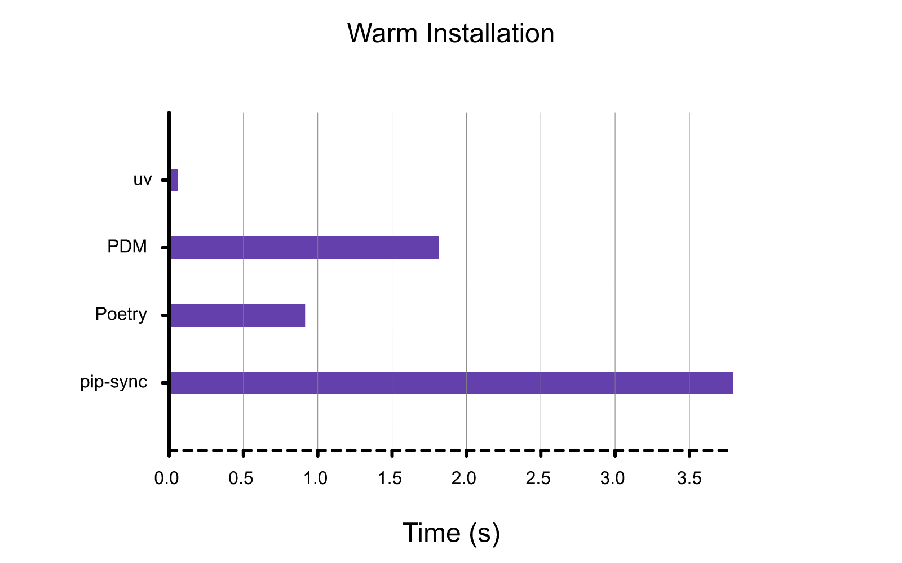
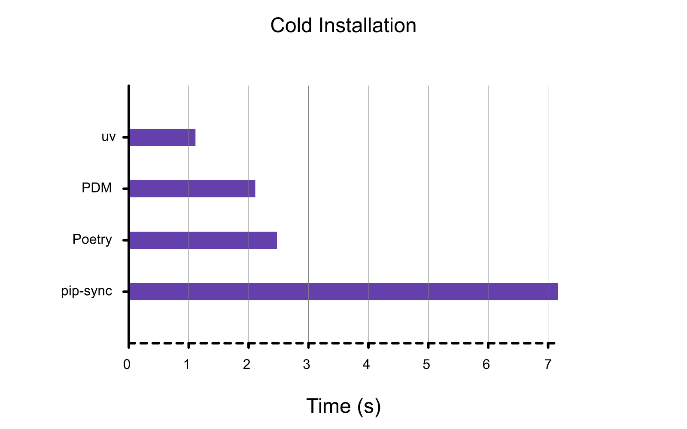
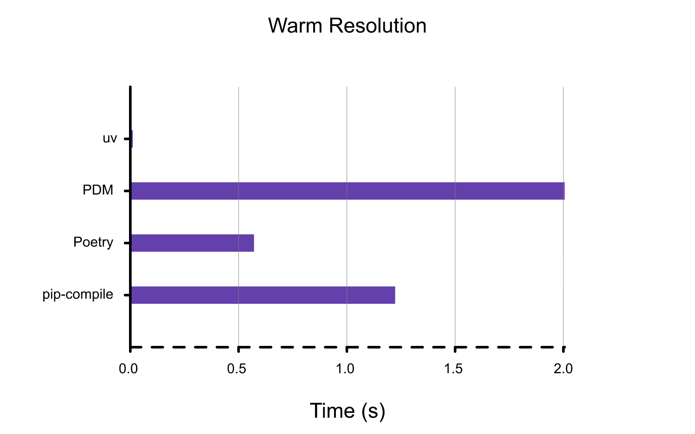
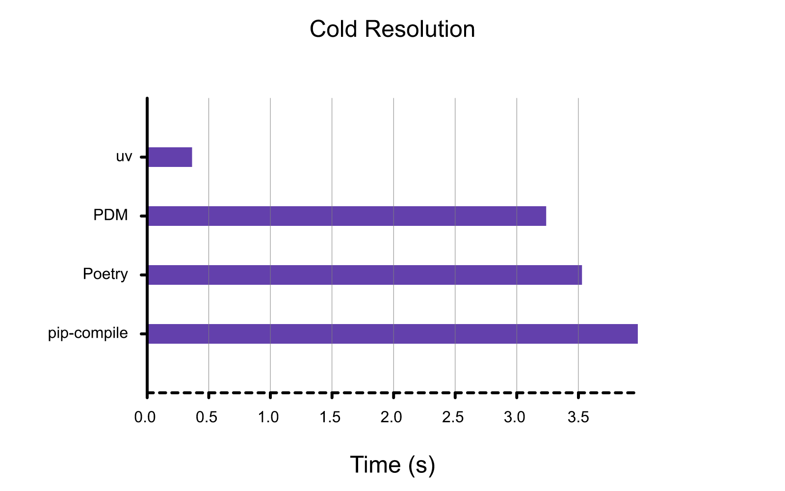

# 基准测试

所有基准测试都是在 macOS 上使用 Python 3.12.4（用于非 uv 工具）计算的，并附带一些重要的注意事项：

- 基准测试性能可能因不同的操作系统和文件系统而有很大差异。特别是，uv 根据底层文件系统的功能使用不同的安装策略。（例如，uv 在 macOS 上使用 reflink，在 Linux 上使用硬链接。）
- 基准测试性能可能因安装的软件包集而有很大差异。例如，一个需要构建单个密集型源代码分发的解决方案在不同工具之间可能看起来非常相似，因为瓶颈与工具无关。

本文档以 Trio 的 `docs-requirements.in` 为基准，作为一个真实世界项目的代表性示例。

在每种情况下，条形越小（即越低）越好。

## 热安装

使用热缓存对软件包安装（例如 `uv sync`）进行基准测试。这相当于删除并重新创建一个虚拟环境，然后用您以前在同一台机器上安装过的依赖项来填充它。



## 冷安装

使用冷缓存对软件包安装（例如 `uv sync`）进行基准测试。这相当于在一台新机器上或在 CI 中运行 `uv sync`（假设软件包管理器缓存不在运行之间共享）。



## 热解析

在有热缓存但没有现有锁文件的情况下对依赖项解析（例如 `uv lock`）进行基准测试。这相当于删除现有的 `requirements.txt` 文件，以从 `requirements.in` 文件重新生成它。



## 冷解析

使用冷缓存对依赖项解析（例如 `uv lock`）进行基准测试。这相当于在一台新机器上或在 CI 中运行 `uv lock`（假设软件包管理器缓存不在运行之间共享）。



## 复现

所有基准测试都是使用 `scripts/benchmark` 包生成的，该包包装了 [`hyperfine`](https://github.com/sharkdp/hyperfine) 以方便对 uv 与各种其他工具进行基准测试。

基准测试脚本本身有几个要求：

- 本地的 uv release 构建 (`cargo build --release`)。
- 在您的路径中安装生产 `uv` 二进制文件。
- 在您的系统上安装了 [`hyperfine`](https://github.com/sharkdp/hyperfine) 命令行工具。

要对 pip-compile、Poetry 和 PDM 进行解析基准测试：

```shell
uv run resolver \
    --uv-project \
    --poetry \
    --pdm \
    --pip-compile \
    --benchmark resolve-warm --benchmark resolve-cold \
    --json \
    ../requirements/trio.in
```

要对 pip-sync、Poetry 和 PDM 进行安装基准测试：

```shell
uv run resolver \
    --uv-project \
    --poetry \
    --pdm \
    --pip-sync \
    --benchmark install-warm --benchmark install-cold \
    --json \
    ../requirements/compiled/trio.txt
```

两个命令都应从 `scripts/benchmark` 目录运行。

运行基准测试脚本后，您可以通过以下方式生成相应的图表：

```shell
cargo run -p uv-dev --all-features render-benchmarks resolve-warm.json --title "Warm Resolution"
cargo run -p uv-dev --all-features render-benchmarks resolve-cold.json --title "Cold Resolution"
cargo run -p uv-dev --all-features render-benchmarks install-warm.json --title "Warm Installation"
cargo run -p uv-dev --all-features render-benchmarks install-cold.json --title "Cold Installation"
```

如果生成的图表中缺少标签，您需要安装 [Roboto 字体](https://fonts.google.com/specimen/Roboto)。

## 致谢

包含此 `BENCHMARKS.md` 文件的灵感来自于 [Orogene](https://github.com/orogene/orogene/blob/472e481b4fc6e97c2b57e69240bf8fe995dfab83/BENCHMARKS.md) 中出色的基准测试文档。

## 故障排除

### 不稳定的基准测试

如果您在运行冷基准测试时看到很高的方差，那么很可能是您遇到了 ISP 的节流或 DDoS 防护。在这种情况下，ISP 会用 TCP 重置强制终止 TCP 连接。我们认为这是由于基准测试在很短的时间内发出了完全相同的请求（对于 `uv` 尤其如此）。一个可能的解决方法是连接到 VPN 以绕过您的 ISP 过滤机制。